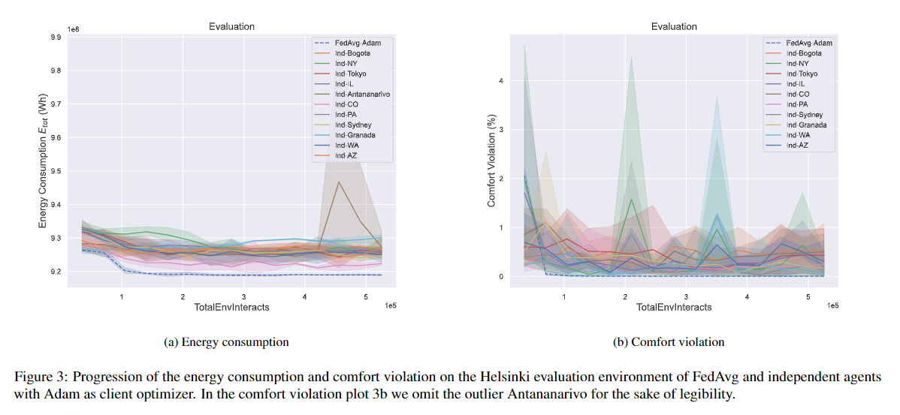

# FedHVAC

This repo is the codebase used in the research article ["Employing Federated Learning for Training Autonomous HVAC Systems"](https://arxiv.org/abs/2405.00389). 

Instructions for running code COMING SOON.

## Abstract

Buildings account for 40 \% of global energy consumption. A considerable portion of building energy consumption stems from heating, ventilation, and air conditioning (HVAC), and thus implementing smart, energy-efficient HVAC systems has the potential to significantly impact the course of climate change. In recent years, model-free reinforcement learning algorithms have been increasingly assessed for this purpose due to their ability to learn and adapt purely from experience. They have been shown to outperform classical controllers in terms of energy cost and consumption, as well as thermal comfort. However, their weakness lies in their relatively poor data efficiency, requiring long periods of training to reach acceptable policies, making them inapplicable to real-world controllers directly. Hence, common research goals are to improve the learning speed, as well as to improve their ability to generalize, in order to facilitate transfer learning to unseen building environments.

In this paper, we take a federated learning approach to training the reinforcement learning controller of an HVAC system. A global control policy is learned by aggregating local policies trained on multiple data centers located in different climate zones. The goal of the policy is to simultaneously minimize energy consumption and maximize thermal comfort. The federated optimization strategy indirectly increases both the rate at which experience data is collected and the variation in the data. We demonstrate through experimental evaluation that these effects lead to a faster learning speed, as well as greater generalization capabilities in the federated policy compared to any individually trained policy. Furthermore, the learning stability is significantly improved, with the learning process and performance of the federated policy being less sensitive to the choice of parameters and the inherent randomness of reinforcement learning. We perform a thorough set of experiments, evaluating three different optimizers for local policy training, as well as three different federated learning algorithms.




## Installation

The *FedHVAC* software has only been tested with [Ubuntu](https://ubuntu.com/) 20.04, [Sinergym](https://github.com/ugr-sail/sinergym/tree/main) v2.0.0, 
[EnergyPlus](https://energyplus.net) v9.5.0 and [BCVTB](https://simulationresearch.lbl.gov/bcvtb/) v1.6.0. We cannot guarantee that
the software will work using any other versions of the mentioned software. 

To install *FedHVAC*, perform the following steps:

#### 1. Clone the repository

```sh
    $ git clone https://github.com/hagstromf/FedHVAC.git
```

#### 2. Configure Conda environment

We have provided the file `fed_hvac_environment.yml` to install all the necessary libraries to run *FedHVAC* using conda. 
To configure the conda environment, run the following commands:

```sh
    $ cd FedHVAC
    $ conda env create -f fed_hvac_environment.yml
    $ conda activate fed_hvac
```

#### 3. Install EnergyPlus

Install EnergyPlus version 9.5.0. Follow the instructions [here](https://energyplus.net/downloads) and
install it for Linux (only Ubuntu 20.04 is supported). Choose any location to install the software. 
Once installed, a folder called `Energyplus-9-5-0` should appear in the selected location.

#### 4. Install BCVTB 

Follow the instructions [here](https://simulationresearch.lbl.gov/bcvtb/Download) for
installing BCVTB (v1.6.0) software. Choose any location to install the software. 
Another option is to copy the `bcvtb` folder from [this repository](https://github.com/zhangzhizza/Gym-Eplus/tree/master/eplus_env/envs).

#### 5. Set environment variables

Two environment variables must be set: `EPLUS_PATH` and
`BCVTB_PATH`, with the locations where EnergyPlus and BCVTB are
installed respectively.

```sh
    $ export EPLUS_PATH=PATH/TO/Energyplus-9-5-0
    $ export BCVTB_PATH=PATH/TO/bcvtb
```

#### 6. Test the installation

To check if everything has been installed correctly, run the following test simulation:

```sh
    $ python -m src.scripts.multi_agents --algorithm SAC --config configs/test_run.yaml
```


## Running the code

#### 1. Running a training simulation

To run a training simulation, execute the `multi_agents.py` script with desired arguments:

```sh
    $ python -m src.scripts.multi_agents --algorithm ALGORITHM_NAME --configs PATH_TO_CONFIG_FILE ...
```

`--algorithm` and `--configs` are required arguments. You have to specify the RL algorithm used (either SAC or TD3) and the configuration file specifying the training context (which federated algorithm to use, which training environments to use and so on).

To get a full list of available arguments, run the command:

```sh
    $ python -m src.scripts.multi_agents --help
```

As an example, to run a simulation using SAC and FedAvg, with client learning rate `0.001` and masking threshold `0.0`, and where the performance of the global agent is evaluated every `eval_freq` episodes (defined in `configs/fedavg.yaml`), run the command:

```sh
    $ python -m src.scripts.multi_agents --algorithm SAC --configs config(fedavg.yaml) --client_lr 0.001 --mask_thres 0.0 --eval
```

See folder `configs/` for available training config files. You can customize these files to fit your needs. We have defined custom training environments in sinergym_extend/__init__.py. For more available environments and more information on how the underlying simulation environments work, see [Sinergym](https://github.com/ugr-sail/sinergym/tree/main).

#### 2. Plotting results

To plot the results of a training simulation, execute the `plot.py` script with desired arguments:

```sh
    $ python -m src.scripts.plot --logdirs PATH_TO_SIMULATION_FOLDER_1 PATH_TO_SIMULATION_FOLDER_2 ...
```

`--logdirs` is a required argument, which specifies the path to the simulation data you wish to plot. You can provide the path to multiple simulation folders to compare the results of multiple simulations in the same plot.

To get a full list of available arguments, run the command:

```sh
    $ python -m src.scripts.plot --help
```

#### 3. Printing a summary of the results

If you want to get a summary of the results of a set of simulations, execute the `print_summary.py` script with desired arguments:

```sh
    $ python -m src.scripts.print_summary --logdirs PATH_TO_SIMULATION_FOLDER_1 PATH_TO_SIMULATION_FOLDER_2 ...
```

`--logdirs` is a required argument, which specifies the path to the simulation data you wish to summarize. It will summarize the data from all subfolders of the specified path. You can also specify the path to multiple different simulation folders to compare their results.

To get a full list of available arguments, run the command:

```sh
    $ python -m src.scripts.print_summary --help
```

#### 4. Using tensorboard

If you've set the logger flag under wrapper_config in the config file to True, the simulation while also store tensorboard data. To launch tensorboard with the simulation data, run the following command:

```sh
    $ tensorboard --logdir PATH_TO_SIMULATION_FOLDER
```
